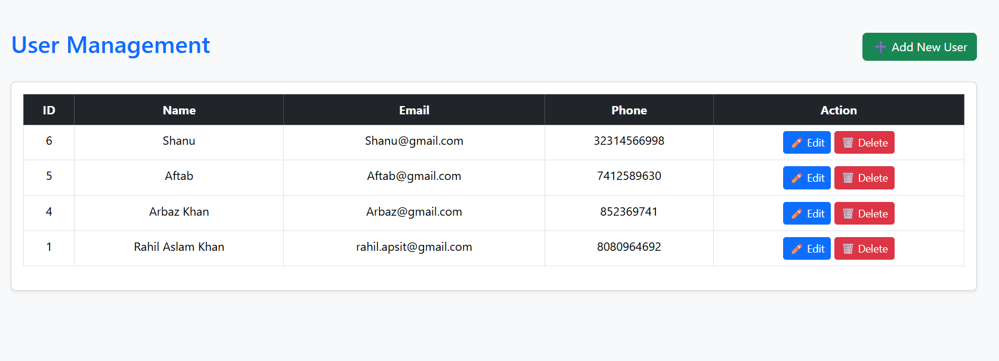
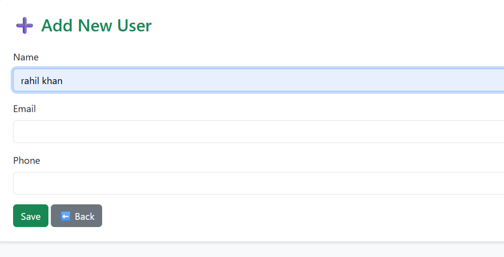

# 🚀 PHP CRUD Application (with MySQL + Bootstrap 5)

A simple **CRUD (Create, Read, Update, Delete)** application built with **PHP** and **MySQL**, styled with **Bootstrap 5** for a clean, modern UI.  
This project demonstrates the basics of database operations in PHP while keeping the interface user-friendly.

---

## 📸 Screenshots

### 🏠 Home Page (List Users)


### ➕ Add User


### ✏️ Edit User


---

## ⚡ Features
- ✅ Create new users with **Name, Email, Phone**  
- ✅ Read & display users in a **responsive Bootstrap table**  
- ✅ Update user details with **prefilled forms**  
- ✅ Delete users with a **confirmation popup**  
- ✅ Styled with **Bootstrap 5** for a professional UI  
- ✅ Clean and simple file structure  

---

## 🛠️ Tech Stack
- **Backend**: PHP (Core PHP, MySQLi)
- **Database**: MySQL
- **Frontend**: HTML5, CSS3, Bootstrap 5
- **Environment**: XAMPP / WAMP / MAMP (any PHP server)

---

## 📂 Project Structure
CRUD-Application-Using-PHP/
│── db.php
│── index.php
│── create.php
│── update.php
│── delete.php
│── README.md
└── image/
    ├── img1.png
    ├── img2.png
    └── img3.png

---

## ⚙️ Setup Instructions

1. **Clone this repo** or download ZIP:
   ```bash
   git clone https://github.com/your-username/php-crud-app.git
   cd php-crud-app
Setup database
Import the following SQL in your MySQL server:

CREATE DATABASE crud_app;
USE crud_app;

CREATE TABLE users (
  id INT AUTO_INCREMENT PRIMARY KEY,
  name VARCHAR(100) NOT NULL,
  email VARCHAR(100) NOT NULL,
  phone VARCHAR(15) NOT NULL
);


Configure database connection
Update db.php with your MySQL username & password if needed:

$servername = "localhost";
$username = "root";
$password = "";
$dbname = "crud_app";


Run the project

Place the folder in your server directory:

For XAMPP: htdocs/crud_app/

For WAMP: www/crud_app/

Start Apache & MySQL from XAMPP/WAMP.

Visit in browser:
👉 http://localhost/crud_app/

🚀 Future Enhancements

🔒 Secure with prepared statements (PDO/MySQLi)

🔑 Add user authentication (login system)

📊 Add search, sort, and pagination

🌙 Dark mode UI

🤝 Contributing

Pull requests are welcome! If you’d like to contribute, fork the repo and submit a PR.


